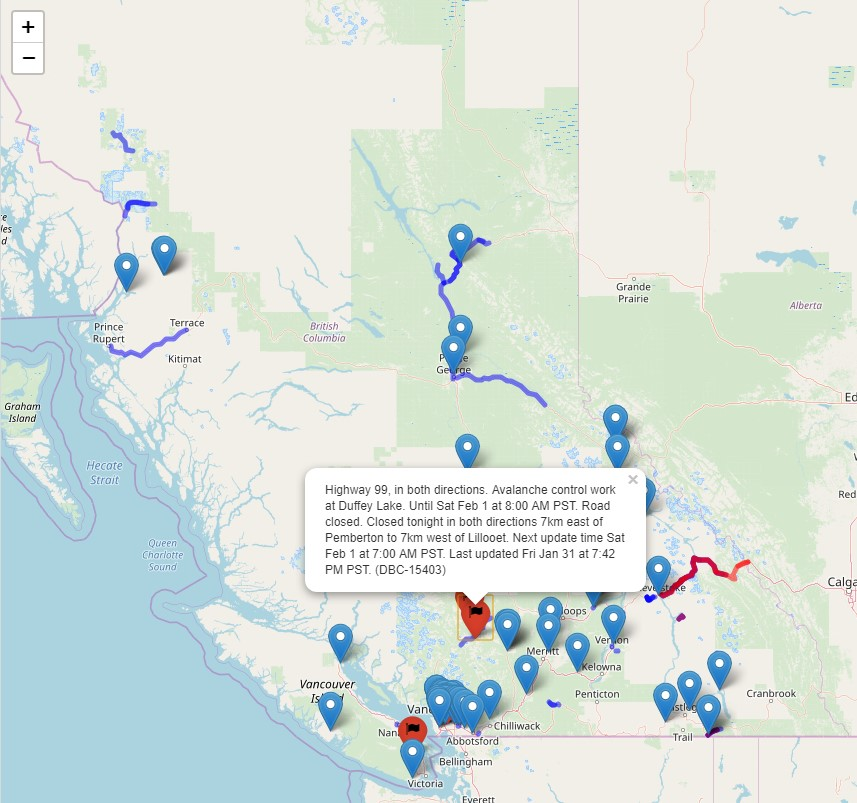

```{r, include = FALSE}
knitr::opts_chunk$set(
  collapse = TRUE,
  comment = "#>"
)
```

```{r setup}
library(driveBC)
```

## Introduction

The Drive BC webpage is used extensively throughout the year as travellers plan routes to destinations throughout BC.  While the official webpage has an interactive map, it is quite slow and hard to customize.  Fortunately, the government supports the **Open511-DriveBC API** which allows members of the public to pull information and customize as desired.  

With this in mind, we created a driveBC API wrapper that takes inputs from the user in various functions and produces interactive maps that allow further exploration.  The description of these functions is below.

## driveBC_map_major

This function is intended for users who want to know current (and historical) incidents throughout BC that have been categorized as Major.  Major is defined as follows: *Major Events are defined as incidents, planned events or road conditions which affect the flow of traffic by closing the road, causing delays longer than 30 minutes, or when a Travel Advisory has been issued by the ministry.*  In addition to events reported during the current day, the function has the option to look back an additional number of days based on user input of **days**. A second input, **region** allows the user to select one of BC's 11 regions which are listed below.  Finally, the user can specify the **status** of the incidents, which are categorized as either ACTIVE, ARCHIVED, or ALL.

### BC Regions
|Number|Region Name|
|------|-----------|
| 1    |Lower Mainland|
| 2    |Vancouver Island|
| 3    |Rocky Mountain|
| 4    |West Kootenay |
| 5    |Okanagan-Shuswap|
| 6    |Thompson-Nicola|
| 7    |Cariboo    |
| 8    |Peace |
| 9    |Fort George |
| 10   |Bulkley Stikine |
| 11   | Skeena  |

To generate a map, simplify specify the input parameters and an interactive map will be returned

```{r, eval=FALSE}
map <- driveBC_map_major(10)
map
```


Any active incidents, whether at a specific location or along a section of a highway, will be coloured red, whereas archived incidents are shown in blue.  If the user clicks on either a section of a road or an icon, a text section will pop up which displays the details of the incident.
